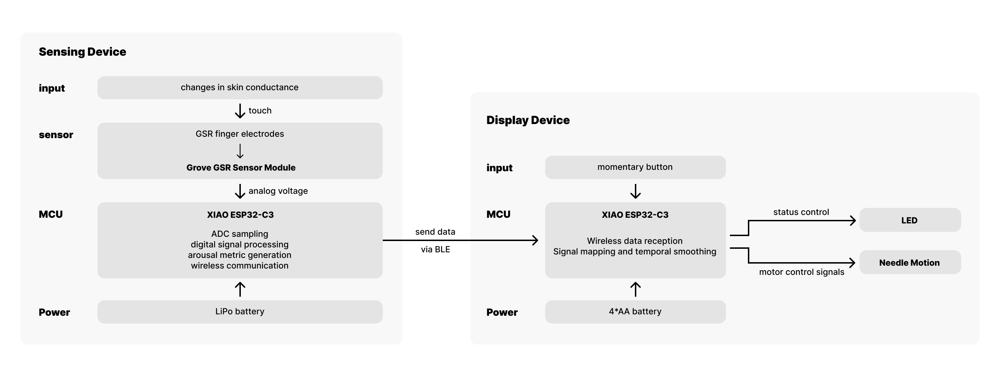

# EmoTrace
#### MSTI TECHIN 514 Final Project           
#### 01/06/2026-03/06/2026

## Project Overview

This project investigates emotion sensing as a process of externalization rather than interpretation.
It measures physiological arousal through galvanic skin response (GSR) and expresses it using a
stepper-motor-driven physical needle display.

Instead of identifying discrete emotions or presenting numerical readouts, the system focuses on
how affective states unfold over time. Changes in arousal are rendered as continuous physical
motion, allowing inertia, gradual transitions, and recovery to remain visible rather than being
collapsed into instantaneous values.

The project is composed of two physically separated devices: a sensing device and a display device,
connected wirelessly via BLE. The sensing device captures and processes physiological signals, while
the display device externalizes these signals as a slow, glanceable, and non-intrusive physical
artifact. Through this separation, the project explores how emotional states can be felt,
noticed, and reflected upon, without being classified or explained away.

---

## System Architecture

**Sensing Device**
- Captures electrodermal activity via finger electrodes and a GSR sensor module
- Performs basic digital signal processing (filtering, baseline normalization)
- Transmits a continuous arousal indicator via BLE

**Display Device**
- Receives arousal data wirelessly
- Drives a stepper-motor-based gauge needle as the primary expressive output
- Provides minimal user input and status indication
- Is implemented on a custom-designed PCB

