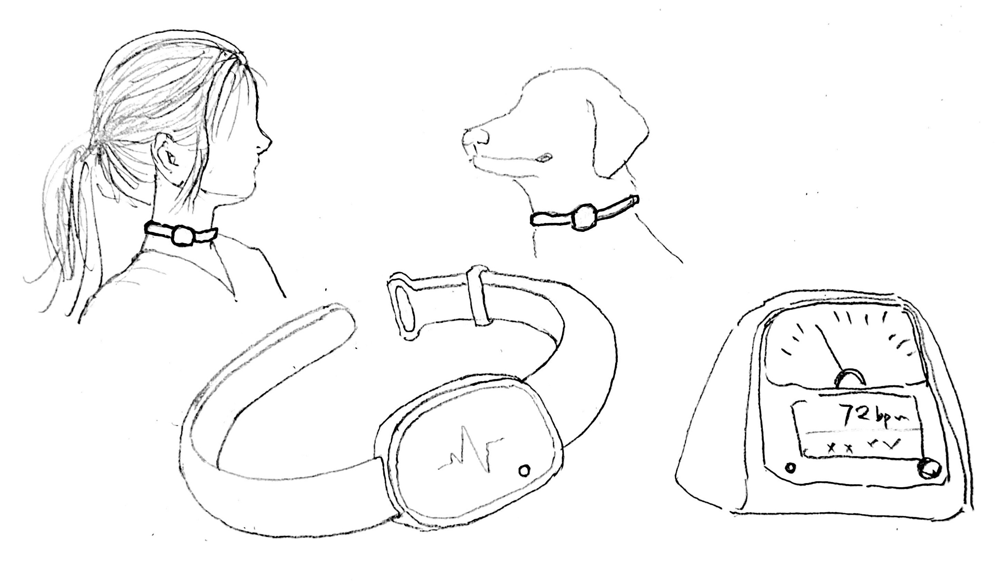
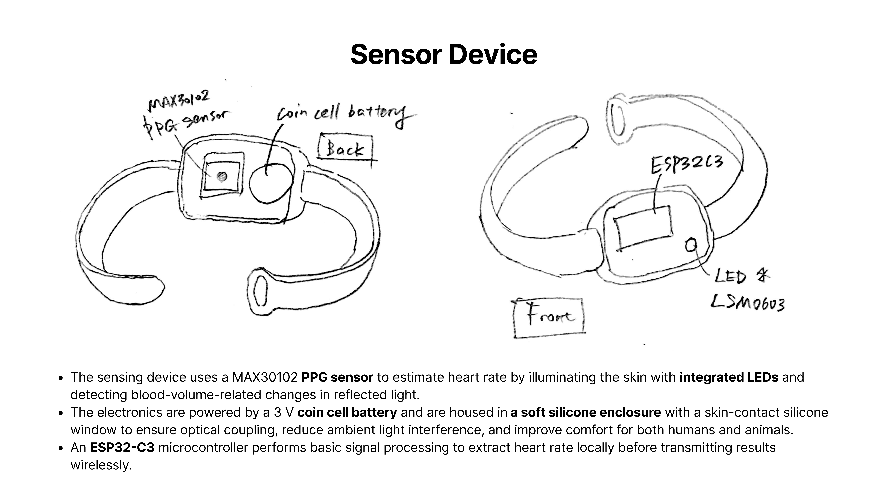
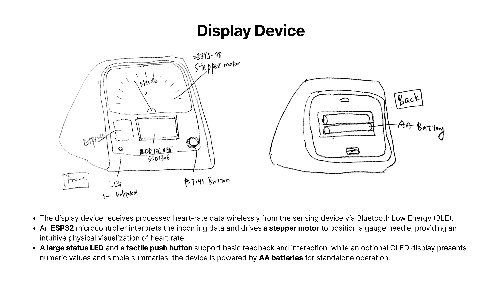

# Shared-Use Heart Rate Choker
#### MSTI TECHIN 514 Final Project           
#### 01/06/2026-03/06/2026

This project is a distributed, wearable choker system designed to estimate heart rate for both humans and companion animals (cats and dogs).  
Using a skin-contact PPG sensor embedded in a modular choker form, the system locally processes heart-rate-related signals and wirelessly transmits summarized results to a physical display device.  
The project explores how physiological sensing can be integrated into non-watch wearable accessories while remaining adaptable across species and neck sizes.

#### Overall System Overview

